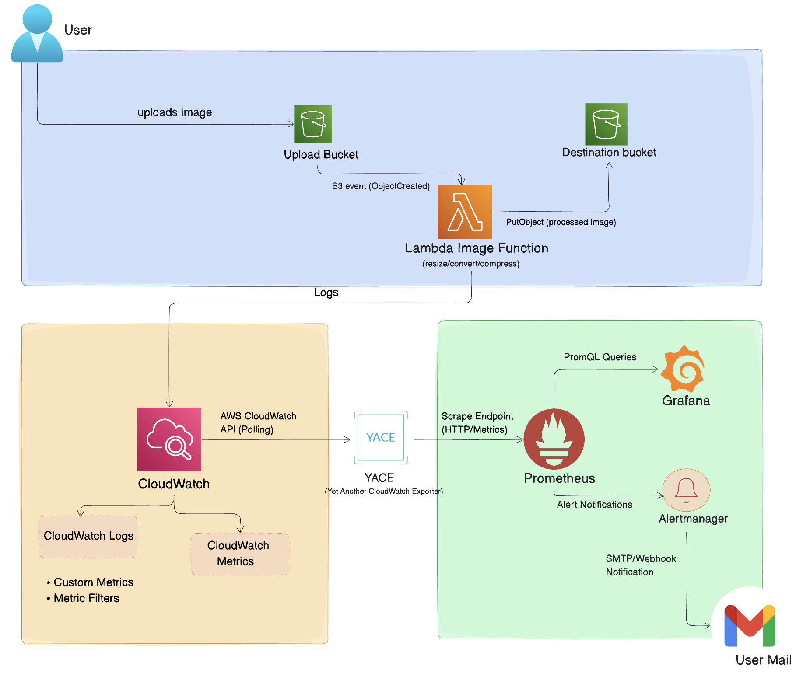
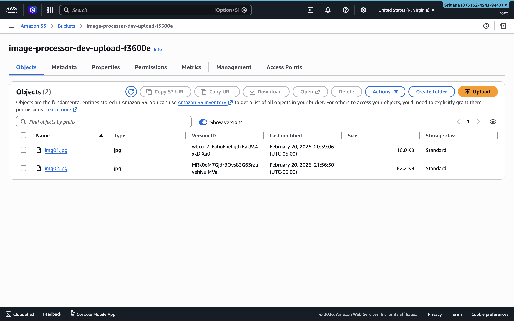
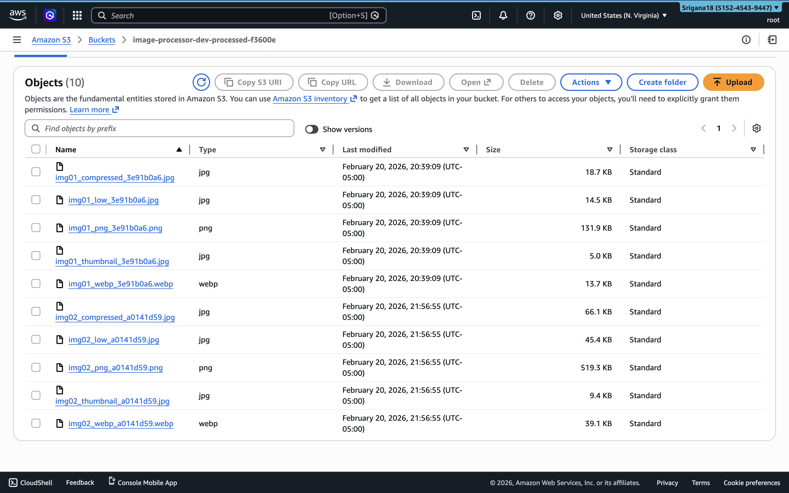
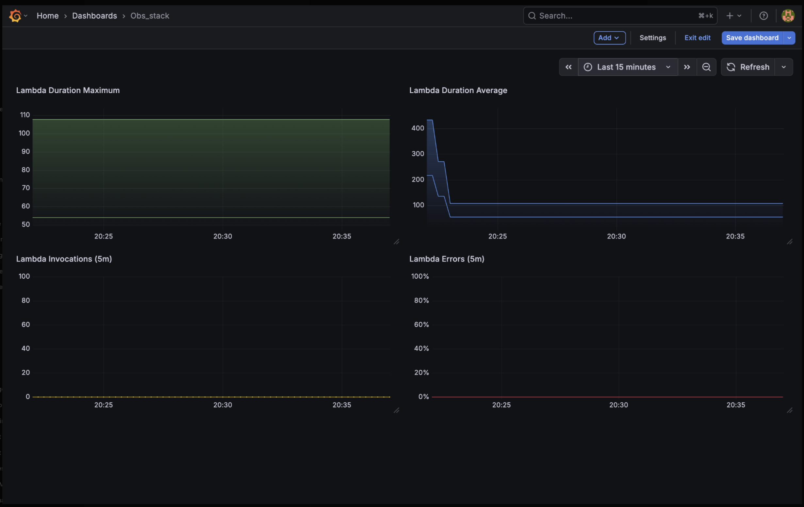
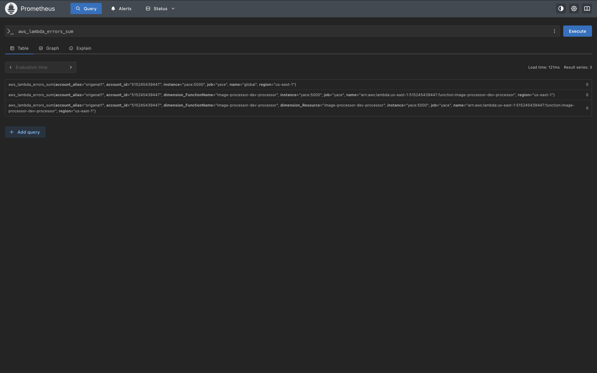

# Lambda Recovery Loop

A serverless image-processing pipeline on AWS (S3 → Lambda) with a self-healing observability stack - metrics, tracing, alerting, and automated incident response.

## Architecture

**Flow**
1. Upload image to **Source S3**
2. **S3 event** triggers **Lambda**
3. Lambda processes image (resize/convert/compress)
4. Output saved to **Destination S3**
5. Logs/metrics/traces → **CloudWatch + X-Ray**
6. CloudWatch metrics → **YACE** → **Prometheus** → **Grafana**
7. Alerts → **Alertmanager** → email + webhook
8. Webhook → **Responder Lambda** → auto-throttle or restore processor

<p align="center">
  
</p>

## Tech Stack

- AWS: S3, Lambda, SQS, IAM, CloudWatch, X-Ray, SNS
- IaC: Terraform (modular)
- Observability: Prometheus, Alertmanager, Grafana, YACE (CloudWatch exporter)
- Runtime: Python + Pillow

## Pipeline Demonstration

| Source (Raw Upload) | Destination (Processed Artifacts) |
| :--- | :--- |
|  |  |

## Repository Structure

```text
demo-images/            Test images used to trigger the pipeline

modules/                Terraform modules (reusable building blocks)
  cloudwatch_alarms/     CloudWatch alarms (metrics-based)
  cloudwatch_metrics/    Dashboards, metric filters, custom metrics
  lambda_function/       Processor Lambda, IAM, log group, DLQ
  lambda_responder/      Responder Lambda, Function URL, IAM policy
  log_alerts/            Log-based metric filters + alarms
  s3_buckets/            Source/Destination buckets + security settings
  sns_notifications/     SNS topics + email subscriptions
  observability_ec2/     EC2 module that installs Docker + runs the monitoring stack

observability/           Runtime configs for Prometheus / Alertmanager / Grafana / YACE
  docker-compose.yml     Runs YACE + Prometheus + Alertmanager + Grafana
  .env.example           Example env vars
  prometheus/            Prometheus config + alert rules
  alertmanager/          Alertmanager routing + SMTP + webhook config
  grafana/               Datasource + dashboard provisioning
  yace/                  CloudWatch exporter config

lambda.py                Processor Lambda handler
responder.py             Responder Lambda handler (self-healing)
main.tf / variables.tf   Root Terraform orchestration + inputs/outputs
terraform.tfvars         Your local values (don't commit if it has secrets)
```

## Deploy Infrastructure

```bash
terraform init
terraform apply
```

Copy the `responder_url` output into your `.env` file, then upload an image to the source bucket to trigger the pipeline.

## Run Observability Stack

From `observability/`:

```bash
docker compose up -d
```

Endpoints:
- Grafana → http://<EC2-IP>:3000
- Prometheus → http://<EC2-IP>:9090
- Alertmanager → http://<EC2-IP>:9093

## Observability & Monitoring

### Grafana Dashboard



### Prometheus Metrics Extraction (YACE)



## Self-Healing Behavior

When error rate exceeds 5% of invocations over a 5-minute window:

1. Prometheus fires `HighErrorRate` alert
2. Alertmanager routes webhook to Responder Lambda in <2s
3. Responder throttles processor to 2 concurrent executions
4. On alert resolution, concurrency is automatically restored
5. Failed invocations captured to SQS DLQ with 14-day retention

Zero operator actions required.

## Example PromQL Queries

Invocations (last 1 minute):
```bash
increase(aws_lambda_invocations_sum{dimension_FunctionName="image-processor-dev-processor"}[1m])
```
Error rate:
```bash
increase(aws_lambda_errors_sum{dimension_FunctionName="image-processor-dev-processor"}[5m])

/ increase(aws_lambda_invocations_sum{dimension_FunctionName="image-processor-dev-processor"}[5m])
```

Concurrent executions:
```bash
aws_lambda_concurrentexecutions_maximum{dimension_FunctionName="image-processor-dev-processor"}
```

## Alerts

| Alert | Condition | Action |
|---|---|---|
| HighErrorRate | >5% error rate over 5m | Webhook → auto-throttle |
| LambdaHighDuration | max duration >2000ms | Email |
| LambdaNoInvocations | no invocations in 10m | Email |

Alert rules defined in `observability/prometheus/rules/`

## Cleanup

```bash
docker compose down -v
terraform destroy
```
